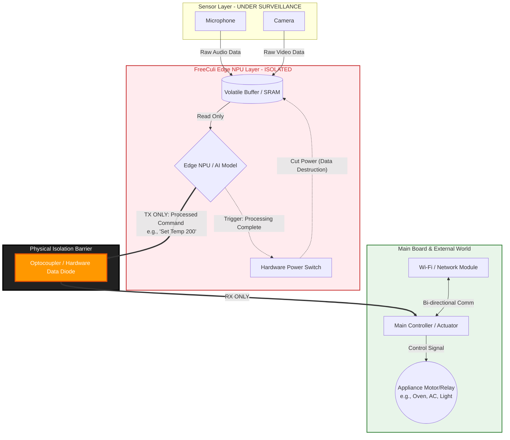

# FreeCuli HFSCA: Zero-Cloud Hardware Reference Architecture v1.0 (The Fortress)

> [!WARNING]
> **LEGAL NOTICE: CERN-OHL-S v2.0 Licensing (Hardware)**
> This reference architecture, including its specific hardware flow, data diode implementations, and memory isolation schematics, is licensed under the CERN Open Hardware Licence Version 2 - Strongly Reciprocal (CERN-OHL-S). Any physical hardware appliance, smart home device, or Edge AI board that implements, derives from, or utilizes the specific data isolation flow described herein is considered a "Derivative Work" and MUST release its complete hardware schematics under the same CERN-OHL-S license, or obtain a commercial exemption license from FreeCuli.

> [!IMPORTANT]
> **LEGAL NOTICE: CC-BY-ND 4.0 Licensing (Documentation & Specification)**
> The text, schematics, and definitions within this document are licensed under the Creative Commons Attribution-NoDerivatives 4.0 International License (CC-BY-ND 4.0). You are free to share and redistribute this material in any medium or format, provided you give appropriate credit to FreeCuli. However, if you remix, transform, or build upon the material (e.g., attempt to create a derivative "X-Brand Standard" by altering this text), you may NOT distribute the modified material. This ensures FreeCuli remains the sole, immutable authority over the HFSCA standard.

> [!IMPORTANT]
> **LEGAL NOTICE: Cross-Referencing & Operational Compliance**
> This hardware reference architecture is inherently bound to the operational and privacy specifications defined in the official [FreeCuli Smart Kitchen Standards Protocol](https://github.com/FreeCuli/smart-kitchen-standards). Compliance requires simultaneous adhesion to both frameworks. A hardware implementation without the corresponding operational compliance protocol is deemed a violation of the FreeCuli standard.

## 1. Introduction & The Zero-Cloud Axiom

Traditional "Smart Kitchen & Home" appliances inherently violate user privacy (GDPR/KVKK) by transmitting audio and visual data captured by their microphones and cameras to cloud servers. The **FreeCuli HFSCA (Hands-Free Semantic Culinary Assistant)** architecture, originally built for smart kitchens but universally applicable, eliminates this violation not through software promises, but through **Immutable Laws of Physical Hardware**.

This document defines the *unchangeable and non-negotiable* core hardware flow that any HFSCA-compliant smart home or kitchen appliance (e.g., oven, air conditioner, robot vacuum) MUST possess to guarantee a "Zero-Cloud" environment.

## 2. The Indestructible Fortress: 4 Core Hardware Locks

Any manufacturer wishing to produce an HFSCA-compliant device SHALL physically implement the following 4 hardware rules. Software-based isolations (VLANs, Firewalls, OS-level sandboxing) are STRICTLY UNACCEPTABLE.

### 2.1. Absolute Physical Air-Gap
Peripherals such as cameras and microphones CANNOT be electrically connected to any network-capable modules of the device (Wi-Fi, Ethernet, Bluetooth SoC). Sensors may ONLY be connected to the isolated **Edge NPU/MCU (Edge AI Chip)** responsible for local processing.

### 2.2. Hardware Unidirectional Data Diode
The Edge NPU must transmit the inference result (e.g., the command "Set heat to 200 degrees" or "Turn off light") to the device's Main Actuator/MCU. However, this transmission cable MUST be isolated using a **physical data diode** (e.g., an Optocoupler / Opto-isolator). 
*Rule:* Data (processed commands) may flow FROM the NPU TO the Main Controller; however, a data "read/pull" operation FROM the Main Controller (and external network) TO the NPU or sensors must be electrically impossible. This rule is strictly not limited to optical optocouplers. ANY electronic component arrangement, integrated circuit, semiconductor topology, or physical boundary that enforces unidirectional data flow FROM the NPU TO the Main Controller—including but not limited to Optical Opto-isolators, Magnetic/Inductive Couplers, Capacitive Isolation Barriers, Digital Isolators with RF coupling, Galvanic Isolation ICs, or Tri-state Buffer logic configured in hardware-locked write-only topologies—falls inherently under this reference architecture and is subject to the CERN-OHL-S license. Any architectural implementation that achieves the physical effect of one-way inference transfer while blocking reverse data read/pull operations is considered a Derivative Work.

### 2.3. Lethal Volatile Buffer
Sensor data (Raw Audio and Video) is recorded into a temporary SRAM (Volatile Buffer) within the NPU. The exact millisecond the model completes its inference and transmits the result (command) to the Main Controller, the power to the SRAM buffer MUST be cut via a Hardware Interrupt, physically destroying the audio/video data.

### 2.4. The "Poisoned Sensor" Rule
An absolute rule to prevent engineering bypasses: **ALL (100% without exception) audio and visual sensors** on the device MUST connect EXCLUSIVELY to the isolated NPU. If even a single secondary microphone or sensor is directly connected to the network-capable (Wi-Fi) chip under the excuse of "wake-word detection," the device immediately loses certification and is deemed in violation of the standard.

---

## 3. Hardware Data Flow Schematic

The schematic below illustrates the absolute data flow directions and isolation barriers of an HFSCA-compliant device. This schematic is not a "recommendation"; it is the **Mandatory Reference Architecture** licensed under CERN-OHL-S.

### 3.1 Schematic Explanation
1. **Sensor Layer:** Raw audio and video write to the `Volatile Buffer` (SRAM).
2. **Isolated Layer:** The NPU processes the data. The moment it generates a meaningful command (Text or Hex), the `Hardware Power Switch` cuts electricity to the SRAM, physically destroying the original media (Strict GDPR Compliance).
3. **Isolation Barrier (Optocoupler):** The command is transmitted to the `Main Controller` via the `Hardware Data Diode`. Due to the physical nature of the diode, the `Main Controller` or its attached `Wi-Fi` module cannot reach back into the NPU or listen to the audio flowing from the sensors. Wi-Fi can only transmit state telemetry (e.g., "Device is running, temperature is 200") from the Main Controller to the cloud/mobile app.

## 4. Compliance & Licensing Implications

When any device manufacturer implements the "Physical Air-Gap and Diode" schematic above to release a smart home or kitchen appliance with "Zero-Cloud" privacy guarantees;

1. **Open Source Obligation:** Pursuant to the CERN-OHL-S v2.0 license, the manufacturer MUST publish all motherboard schematics (PCB gerber files, bill of materials) of the said device as open source on GitHub or a public portal.
2. **Trademark Infringement:** This project's baseline schematics are completely open-source under CERN-OHL-S v2.0. However, the right to use the registered `FreeCuli Certified: Zero-Cloud` trademark, logo, or badge on product packaging, marketing materials, or software is subject to a separate, independent B2B Compliance and Certification Agreement by the FreeCuli Standards Organization. (Trademark Law).
3. **Patent Retaliation Clause:** The provision that locks in legal armies: If any technology giant using this standard files a lawsuit against FreeCuli or another manufacturer utilizing this standard claiming, "A portion of this technology is my patent," that giant company's right to use the FreeCuli license is IMMEDIATELY REVOKED WORLDWIDE. This prevents Big Tech firms from acting as "Patent Trolls."
4. **Commercial Exemption:** Manufacturers wishing to keep their motherboard schematics as a trade secret (e.g., Bosch, Samsung, Xiaomi) MUST purchase a closed-source (proprietary) **Commercial License** from FreeCuli to utilize the FreeCuli standards without license contamination.
5. **Methodological & Functional Equivalency:** The "Methodological Equivalency" declared herein does not protect an abstract idea of privacy. It explicitly covers the simulation or imitation of the specific functional constraints (Functional Requirements)—such as the exact electrical thresholds, physical data-diode topologies, and microsecond timing of the volatile RAM power-cuts—created by the 4 Core Hardware Locks defined in the Zenodo (DOI: 10.5281/zenodo.22838474) Prior Art. Writing a functional equivalent in alternative programming languages (Rust, C++, etc.) does not exempt a manufacturer if these specific functional hardware limitations are replicated.
6. **Third-Party Non-Consent Privacy Protection (Socio-Legal Framework):** Traditional cloud-connected ambient appliances rely strictly on the primary buyer's software license agreement ("End-User Consent") to bypass legal liabilities. However, this consent is legally null and void regarding third-party individuals (e.g., visitors, children, domestic workers, or secondary residents) present within the appliance's sensory perimeter whose data is captured without their explicit consent, constituting a systemic violation of Constitutional Privacy Rights, KVKK (Article 5), and GDPR (Article 6). Because the HFSCA standard physically enforces absolute local containment and immediate hardware-level microsecond data destruction (Lethal Volatile Buffer), it guarantees absolute compliance for third-party privacy protection by rendering non-consensual remote data transmission impossible. Consequently, implementing this standard is deemed a structural regulatory requirement for any hardware vendor operating in public, commercial, or residential spaces to mitigate severe regulatory liabilities regarding non-consensual ambient surveillance.
7. **Compliance Verification vs. IP Detection:** The laboratory tests defined in this repository (e.g., oscilloscope reverse-channel leakage tests, cold-boot SRAM extraction tests) are NOT Intellectual Property (IP) infringement detectors. They are independent **Technical Compliance Verifiers** designed solely to audit whether a device adheres to the HFSCA v1.0 hardware constraints.
