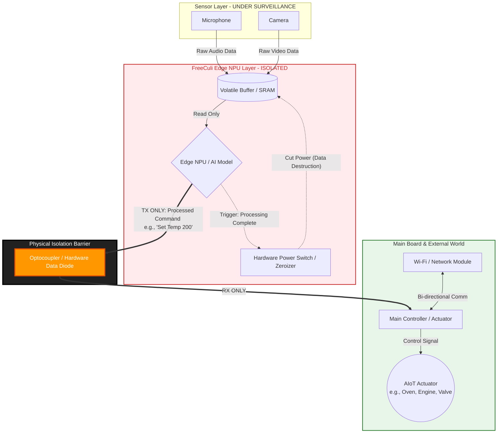

# Universal Hardware Reference Architecture

> [!NOTE]
> **Evolution of the Standard:** Originally pioneered as the HFSCA (Hands-Free Semantic Culinary Assistant) reference architecture for smart kitchens, this methodology has evolved into the universal **ZC-CORE v3.2.0 standard** for all privacy-critical, server-independent autonomous AIoT and Edge AI hardware (Smart Home, Medical, Industrial, Defense).

> [!IMPORTANT]
> **LEGAL NOTICE: Separation of Technical Standard and Legal Licensing**
> This document defines the strict **technical architecture and engineering properties** of the ZC-CORE methodology. For all legal licensing models, CERN-OHL-S v2.0 implications, patent retaliation clauses, and commercial exemption terms, refer strictly to the `zero-cloud-dual-licensing.md` document in this repository.

## 1. Introduction & The "Trust Boundary" Axiom

Traditional cloud-connected IoT devices face significant raw-sensor exposure risks by transmitting raw sensory data (audio/visual) to external networks. The **FreeCuli ZC-CORE Methodology** addresses raw-sensor exposure risks not through software promises, but through **Hardware-Enforced Trust Boundaries** and **On-Device Edge AI Inference**.

The core axiom of Zero-Cloud AIoT is that **sensitive raw sensor data SHALL NOT leave the Trusted Processing Domain.** The device's primary intelligent functions MUST be **Server-Independent and Mathematically Verifiable**.

### 1.1 Technology-Neutral Equivalence Principle (Normative)
A mechanism SHALL remain subject to the applicable ZC-CORE security invariant where it performs substantially equivalent data acquisition, storage, processing, buffering, communication, control, or information-transfer functions, regardless of the implementation technology or architectural nomenclature used. 
This provision is strictly technology-neutral and non-exhaustive. Any specific technological examples provided in this architecture (e.g., "SRAM", "Optocoupler") are **informative and illustrative**, and DO NOT limit the scope of the invariant.

## 2. The Indestructible Fortress: Mandatory Hardware Locks (v3.2.0)

Any manufacturer wishing to produce a ZC-CORE compliant AIoT device SHALL physically implement the following hardware rules. Software-based isolations (VLANs, Firewalls) are STRICTLY UNACCEPTABLE as primary barriers. Manufacturer compliance is verified via the Conformance Test Specification (CTS), requiring physical evidence (BOMs, PCB schematics, and lab measurements).

### 2.1. Absolute Physical Air-Gap (Sensor Isolation)
Peripherals such as cameras, microphones, and biometric scanners CANNOT be electrically connected to any network-capable modules of the device (Wi-Fi, Ethernet, Bluetooth SoC). Sensors may ONLY be connected to the isolated **Edge NPU/MCU (Trusted Domain)** responsible for local inference.

### 2.2. Hardware Unidirectional Data Diode
The Edge NPU must transmit the inference result (e.g., the command "Set heat to 200 degrees" or "Turn off light") to the device's Main Actuator/MCU. However, this transmission cable MUST be isolated using a **physical data diode** (e.g., an Optocoupler / Opto-isolator). 
*Rule:* Data (processed commands) may flow FROM the NPU TO the Main Controller; however, a data "read/pull" operation FROM the Main Controller (and external network) TO the NPU or sensors must be electrically impossible. 

### 2.3. Lethal Volatile Buffer (Cryptographic Zeroization)
Sensor data (Raw Audio and Video) is recorded into a temporary SRAM (Volatile Buffer) within the NPU. The exact millisecond the Edge AI model completes its inference and transmits the result, the power to the SRAM buffer MUST be cut via a Hardware Interrupt, physically destroying the audio/video data. All copies (CPU registers, cache, DMA buffers) must be zeroized.

### 2.4. The "Poisoned Sensor" Rule & Sensor Inventory Completeness
An absolute rule to prevent engineering bypasses: **ALL (100% without exception) audio, visual, and auxiliary sensors** on the AIoT device MUST connect EXCLUSIVELY to the isolated NPU. If even a single secondary microphone is directly connected to the network-capable chip under the excuse of "wake-word detection," the device violates the standard. Manufacturers must submit a **Sensor Inventory (BOM & Schematics)** proving compliance.

### 2.5. Trusted Execution Artifact Chain (Secure Boot & Model Integrity)
Physical isolation is meaningless if an attacker can manipulate the Edge AI firmware. The Edge NPU MUST implement a strict **Trusted Execution Artifact Chain**. This chain requires cryptographic verification of the Boot ROM, Bootloader, OS/Firmware, **and the AI Model Weights/Parameters** before execution. Keys must be stored in hardware-protected enclaves.

### 2.6. Debug Port Isolation (Anti-Extraction)
Leaving hardware debug interfaces (JTAG, SWD, UART) physically open compromises the Trust Boundary. Debug ports routing into the Trusted Domain MUST be physically severed or cryptographically locked in production environments.

### 2.7. Secure Update Mechanism & Revocation
Any firmware or AI model updates sent from the Untrusted Domain into the Trusted Domain (NPU) must pass through a strict cryptographic Verification layer, including mandatory anti-rollback counters and key revocation handling.

### 2.8. Trusted-Domain Control Surface Inventory (Power, Reset, Clock, DMA)
A data diode only protects the data line. The manufacturer must formally document the **Control Surface Inventory**. The Main MCU must NOT be able to manipulate the reset (RST), clock (CLK), power, watchdog, or direct memory access (DMA) lines of the NPU to interrupt the Lethal Volatile Buffer destruction sequence.

### 2.9. ZC-CORE Threat Model & Mitigations

| Attacker Profile | Target | Required ZC-CORE Mitigation |
| :--- | :--- | :--- |
| **Remote Attacker (Wi-Fi Hack)** | Microphone/Camera Data | **Physical Air-Gap** (Sensor Isolation) |
| **Compromised Main MCU** | Read raw data from NPU | **Hardware Data Diode** (One-way boundary) |
| **Physical Attacker (Lab)** | Extract latent audio from RAM | **Lethal Volatile Buffer** (Power kill / Zeroization) |
| **Supply-Chain Attacker** | Run malicious AI inference | **Trusted Artifact Chain** (Model & Firmware Signature) |
| **Physical Attacker (Lab)** | JTAG RAM Dump / DMA Hijack | **Debug & Control Surface Isolation** |

---

## 3. ZC-CORE Hardware Data Flow Schematic

The schematic below illustrates the absolute data flow directions and isolation barriers of a ZC-CORE compliant AIoT device. This schematic is the **Mandatory Reference Architecture**.

### 3.1 Schematic Explanation
1. **Sensor Layer:** Raw audio and video write to the `Volatile Buffer` (SRAM).
2. **Isolated Layer:** The Edge NPU processes the data locally. The moment it generates a meaningful command (Text or Hex), the `Hardware Power Switch` physically destroys the original media (Privacy-by-Design Architecture).
3. **Isolation Barrier:** The command is transmitted via the `Hardware Data Diode`. The `Main Controller` or its attached `Wi-Fi` module cannot reach back into the NPU or manipulate control surfaces (DMA/Clock) to listen to the audio flowing from the sensors.

## 4. Methodological & Functional Equivalency (Defensive Publication)
The strict security properties defined in this architecture (e.g., unidirectional data flow, memory zeroization, sensor isolation) apply universally to any functional equivalent. Any alternative component (e.g., magnetic isolators, secure enclaves) that replicates the security properties of these hardware locks falls under the ZC-CORE framework as detailed in the Defensive Publication (Zenodo DOI: 10.5281/zenodo.22838473). Evidence-based proof is strictly required via the FC-ZC-CTS.

*(For open-source obligations, CERN-OHL-S v2.0 licensing, trademark rules, and commercial B2B licensing, please refer to zero-cloud-dual-licensing.md).*
